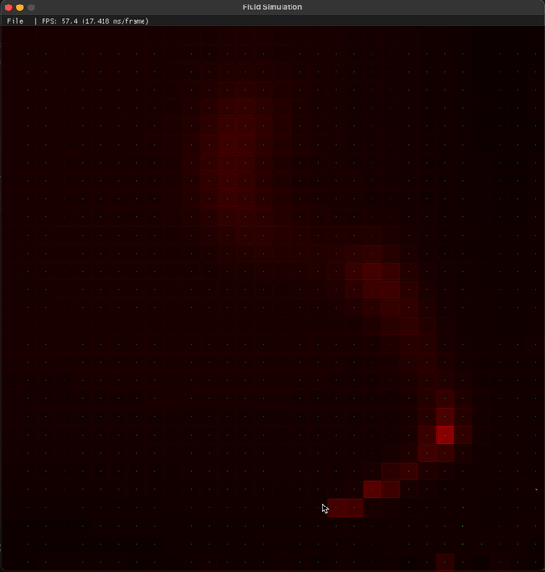

# Fluid Simulation with Navier-Stokes Equations

CMake will download all dependencies with vcpkg

CMake links the toolkit with a relative path. If you vcpkg.cmake is somewhere else, you will need to update the CMakeLists.txt file.

I was unable to continue this project because it was getting extremely difficult to keep a stable fps with CPU rendering. I tried implementing GPU rendering with OpenGL but graphics programming is just too difficult for me at the time.

For now, the simulation doesn't look like it works well because the resolution is very low. A higher resolution would give a better simulation. Something CPU rendering just can't do.

All the rendering is handled by SDL3.
I've also added ImGUI to show FPS.

## References
- [Jos Stam - Real-Time Fluid Dynamics for Games](https://www.dgp.toronto.edu/public_user/stam/reality/Research/pdf/GDC03.pdf)
- [Robert Bridson & Matthias Muller-Fischer - Fluid Simulation for Computer Graphics](https://www.cs.ubc.ca/~rbridson/fluidsimulation/fluids_notes.pdf)
